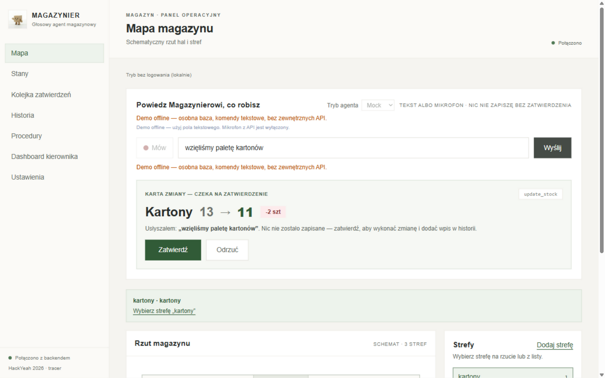
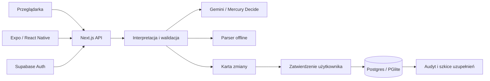

<div align="center">


# MAGAZYNIER

### Powiedz, co robisz. Sprawdź propozycję. Zatwierdź zmianę.

Głosowy asystent magazynu, który łączy **stany, lokalizacje, procedury i zadania zespołu**.

**Next.js 16 · TypeScript · Supabase · Gemini · Expo**

Prototyp stworzony przez **czteroosobowy zespół podczas HackYeah 2026 — Open Task ARTIFICIAL INTELLIGENCE**.

[Szybki start](#szybki-start) · [Rozwiązania techniczne](#rozwiązania-techniczne) · [Architektura](#architektura) · [Pierwotny backend Python](legacy/README.md) · [Testy](#testy-i-skrypty) · [Zespół](#dokumentacja-autorzy-i-licencja)

</div>

---

## Co robi MAGAZYNIER?

W małym magazynie Excel często przestaje odzwierciedlać rzeczywistość: ktoś pobrał towar, zapomniał poprawić stan, a instrukcja pakowania została w głowie jednej osoby. MAGAZYNIER skraca drogę od wykonanej pracy do aktualnych danych. Pracownik mówi lub wpisuje zdanie po polsku, a agent zamienia je w odpowiedź albo czytelną propozycję operacji.

Bieżąca aplikacja wykorzystuje Next.js, TypeScript i PostgreSQL/PGlite oraz klienta mobilnego Expo. Repozytorium zachowuje również **pierwotny backend Python/FastAPI/SQLite**, będący punktem odniesienia dla migracji — jego architekturę, kod i testy opisuje [przewodnik po `legacy/`](legacy/README.md).

Projekt rozwijano z wykorzystaniem narzędzi AI do wspomagania programowania. Integracje LLM i rozpoznawania mowy są też częścią samej aplikacji; ich zakres opisuje sekcja [Prywatność, AI i granice projektu](#prywatność-ai-i-granice-projektu).

**„Wzięliśmy paletę kartonów” → karta `Kartony 13 → 11` → zatwierdzenie → aktualny stan i historia.** Jeśli zapas spadnie poniżej minimum, aplikacja tworzy szkic zamówienia do decyzji kierownika. Pytania „gdzie leży szkło?” i „jak pakujemy szkło?” pozwalają odszukać lokalizację i zapisaną instrukcję bez szukania w arkuszach.



*Zrzut z próby demo. Przed zatwierdzeniem karty stan magazynowy pozostaje bez zmian. W tym scenariuszu paleta oznacza 2 jednostki — to uproszczenie parsera demo.*

## Funkcjonalności

| Obszar | Możliwości |
|---|---|
| **Komendy i głos** | Polecenia po polsku, nagrania i widoczna transkrypcja, doprecyzowanie niejasnych poleceń, karty zmian z zatwierdzeniem lub odrzuceniem. Mikrofon po naciśnięciu, nasłuch na prefix i tryb tekstowy; opcjonalny odczyt odpowiedzi głosem. |
| **Stany magazynowe** | Produkty, wyszukiwanie, sortowanie, ilości, jednostki, minima i lokalizacje. Oznaczenia braków i stanów poniżej progu. Edycja i usuwanie produktów przez kierownika. |
| **Import i eksport** | XLSX/CSV, sugestia mapowania kolumn przez Gemini lub reguły offline, ręczna korekta i zatwierdzenie importu. Eksport aktualnych stanów CSV/XLSX. |
| **Mapa magazynu** | Schemat stref, szczegóły towarów i podświetlenie lokalizacji z odpowiedzi agenta. Ścieżki przejść, sektory i przypisania produktów. Mobilne mapowanie alejek wspomagane wykrywaniem kroków. |
| **Kolejka zatwierdzeń** | Proaktywne szkice uzupełnienia zapasów, decyzje kierownika, podgląd rozpatrzonych szkiców i zbiorcze odrzucanie oczekujących. |
| **Historia** | Audyt operacji z autorem, czasem i szczegółami. Kierownik może cofnąć zmianę stanu; cofnięcie tworzy osobny wpis. |
| **Procedury pakowania** | Opakowanie z katalogu, liczba sztuk na opakowanie i uwagi dla produktu. Pytania o pakowanie. Kierownik zapisuje reguły po zatwierdzeniu karty i może powiązać opakowanie z towarem magazynowym. |
| **Zadania zespołu** | Przydzielanie zadań z opisem i priorytetem, oznaczanie własnych zadań jako przeczytane i wykonane. Pomoc „Jak wykonać?” na podstawie zapisanych procedur. Pytania do agenta o zadania. |
| **Dashboard kierownika** | Podsumowanie zapasów, braków i szkiców, dziennik aktywności z filtrami, trend produktu, raport zmiany i eksport aktywności CSV. Powiadomienia o zdarzeniach wymagających uwagi. |
| **Ustawienia i konta** | Prefix agenta, tryb interpretacji i głosu, TTS, domyślne minimum i ilość zamówienia. Akceptacja kont i role. Informacja o użyciu AI. |
| **Praca awaryjna** | Parser deterministyczny przy braku lub awarii LLM, komendy tekstowe przy braku mikrofonu i osobna baza demo offline. |

### Kontrola nad zmianami

Operacje zapisu proponowane przez agenta wymagają zatwierdzenia karty. Pytania o stan, lokalizację, procedury i zadania nie zmieniają danych magazynowych. Niejasne polecenie prowadzi do doprecyzowania. Serwer waliduje argumenty narzędzi i uprawnienia; zmiana stanu od przygotowania karty powoduje odrzucenie nieaktualnej propozycji.

Szkic zamówienia jest wewnętrzną propozycją: **jego zatwierdzenie nie wysyła zamówienia do dostawcy ani ERP**.

To prototyp hackathonowy. Mapa z przejść telefonu ma szacowane wymiary; nie jest dokładnym skanem hali ani systemem SLAM. Testy automatyczne nie zastępują pomiarów na urządzeniu i weryfikacji usług zewnętrznych.

## Rozwiązania techniczne

| Problem | Rozwiązanie w kodzie | Weryfikacja |
|---|---|---|
| Model może zwrócić błędne narzędzie lub argumenty | [Provider LLM](src/server/llm.ts), walidacja kontraktu i [obsługa komendy](src/server/commands.ts); przy błędzie parser offline. | [Testy providera](src/server/llm.test.ts) i [komend](src/server/commands.test.ts). |
| Stan może zmienić się, gdy użytkownik ogląda kartę | Zapisany snapshot jest porównywany pod blokadą rekordu w transakcji; nieaktualna karta jest odrzucana. | [Scenariusze konfliktów stanów](tests/stale-stock-proposals.test.ts). |
| Ponowienie lub równoczesne żądanie może zdublować operację | [Potwierdzenie propozycji](src/server/commands.ts), [transakcje i decyzje reorder](src/server/db.ts), unikalność oczekującego szkicu w bazie. | [Kontrakty API](tests/api.test.ts) i [testy reorder](src/server/reorder.test.ts). |
| Cofnięcie operacji powinno zachować historię | Undo tworzy wpis kompensujący zamiast usuwać audyt; późniejsze zmiany zapasu pozostają zachowane. | [Testy undo](src/server/undo.test.ts). |
| Demo nie może zależeć wyłącznie od chmury | Parser deterministyczny, wejście tekstowe i [launcher Python](scripts/start-demo.py) z osobną bazą i buildem. | [Testy launchera](scripts/test_start_demo.py) i [instrukcja demo](docs/demo-offline.md). |
| Mapowanie wymaga obsługi niepewnych danych czujnika | [Detektor kroków i geometria PDR](src/lib/pdr.ts) oddzielone od [obsługi czujników webowych](src/lib/pdrSensors.ts); klient mobilny ma [prowadzone mapowanie alejek](mobile/src/lib/guidedScan.ts). | [Testy sygnału syntetycznego i geometrii](src/lib/pdr.test.ts), [testy mapowania mobilnego](tests/mobile-guided-scan.test.ts). |

Testy adaptera postgres.js korzystają również z PGlite przez protokół PostgreSQL. Nie jest to pełne odtworzenie niezależnych sesji produkcyjnego Postgresa; ograniczenia testów współbieżności opisano w [karcie nieaktualnych propozycji](docs/tasks/17-nieaktualne-karty-zapasu.md).

## Architektura



| Warstwa | Technologia i zastosowanie |
|---|---|
| Web | Next.js 16 App Router, React i TypeScript; wspólny projekt UI i API. |
| Interfejs | Tailwind CSS 4; responsywne widoki, karty i mapa. |
| Serwer | Route handlery `src/app/api/*`, logika domenowa `src/server/*`. |
| Dane | PostgreSQL przez `postgres.js`; lokalnie i w testach PGlite przez wspólny `Db`. |
| Tożsamość | Supabase Auth: cookies w webie, Bearer na telefonie, role w `profiles`. |
| AI i mowa | Gemini, opcjonalnie Mercury Decide przez OpenRouter i Whisper przez Groq. |
| Mobile | Expo, React Native, NativeWind 4 / Tailwind 3; osobne zależności i lockfile. |
| Odświeżanie | Polling `GET /api/version`; zapis zwiększa licznik, klient odświeża dane. |
| Testy | Vitest dla domeny i kontraktów, TypeScript i oxlint. |

### Struktura repozytorium

```text
src/
  app/                  Strony, logowanie i API
  components/           Widoki magazynu, dashboard i agent
  lib/                  Klient API, Supabase, polling, głos i typy
  server/               Baza, role, narzędzia, import, zadania, LLM i STT
mobile/                 Klient Expo / React Native
public/                 Excel demo i zasoby marki
scripts/                Inicjalizacja bazy, demo i próby AI
docs/                   PRD, koncept, instrukcje i karty zadań
gui-test-screenshots/    Zrzuty z prób interfejsu
legacy/                 Poprzednia wersja FastAPI / SQLite / Vite
```

### Ewolucja projektu

Pierwotna implementacja łączyła **Python/FastAPI, SQLite i WebSocket** z frontendem **React/Vite**. Podczas hackathonu zespół przeniósł aplikację do Next.js na Vercel: backend działa obecnie w TypeScript, dane przechowuje PostgreSQL/PGlite, a aktualizacje interfejsu korzystają z pollingu. Migrację dokumentuje [commit `b08b793`](https://github.com/SlizDaniel/AiWARE/commit/b08b793).

Kod poprzedniej wersji zachowano w `legacy/`. **Bieżąca aplikacja nie uruchamia tego backendu Python.** Część logiki domenowej i kontraktów testowych została przeniesiona do obecnej implementacji; przewodnik [Pierwotny backend Python](legacy/README.md) wskazuje pliki, testy i przykładowe odpowiedniki po migracji.

Python pozostaje też w bieżących narzędziach: [launcherze demo](scripts/start-demo.py), [diagnostyce intencji Gemini](scripts/check-gemini.py) i [loaderze przykładowych procedur](scripts/load-sample-procedures.py).

Obowiązujący stack webowy opisuje również [AGENTS.md](AGENTS.md); zastępuje pierwotny stack w PRD. Bieżącą aplikację uruchamiasz z katalogu głównego przez npm.

## Szybki start

### Wymagania

- **Node.js ≥ 20.9** i npm, zgodnie z `package.json`.
- Git oraz internet przy pobieraniu zależności.
- Klucze AI i konto Supabase są opcjonalne dla lokalnego startu.
- Python **3.10+** tylko dla opcjonalnego launchera demo i skryptów Python.

### 1. Pobierz i zainstaluj

```bash
git clone https://github.com/SlizDaniel/AiWARE.git
cd AiWARE
npm ci
```

### 2. Przygotuj konfigurację

Windows / PowerShell:

```powershell
Copy-Item .env.example .env.local
```

macOS / Linux:

```bash
cp .env.example .env.local
```

Puste wartości wystarczą do lokalnego startu: aplikacja używa **PGlite w `data/pglite`**, tworzy schemat i dane początkowe, działa bez logowania i interpretuje komendy parserem offline. Jeśli masz własny `.env.local`, zachowaj go zamiast nadpisywać.

### 3. Uruchom

```bash
npm run dev
```

Otwórz **[localhost:3000](http://localhost:3000)**. Wpisz `ile mamy szkła?`, a następnie przetestuj komendę zmiany stanu i zatwierdzenie karty.

**[/api/health](http://localhost:3000/api/health)** pokazuje tryb agenta, rodzaj bazy i tryb logowania. Nie jest pełnym testem dostępności zewnętrznych dostawców AI.

## Testy i skrypty

| Polecenie | Zastosowanie |
|---|---|
| `npm run dev` | Serwer deweloperski. |
| `npm run build` / `npm start` | Build i serwer produkcyjny. |
| `npm test` / `npm run test:watch` | Vitest jednorazowo / obserwacja. |
| `npm run typecheck` | Typy aplikacji webowej. |
| `npm run lint` | oxlint dla `src/`. |
| `npm run db:setup` | Inicjalizacja PostgreSQL, seed i sprawdzenie RLS; wymaga connection stringa. |
| `npm run demo:reset` | Reset osobnej bazy demo przy konfiguracji demo; wcześniej zatrzymaj serwer. |
| `npm run check:gemini` | Prawdziwy model na syntetycznych komendach; wymaga klucza, wywołuje API. |
| `npm run check:decisions` | Porównanie Mercury i Gemini; wymaga obu kluczy, wywołuje API. |
| `npm run mobile:start` | Expo po instalacji zależności `mobile/`. |
| `npm run mobile:typecheck` | Typy klienta mobilnego. |
| `python -m unittest discover -s scripts -p test_start_demo.py` | Testy launchera demo. |

Testy obejmują parser, narzędzia, potwierdzanie, konflikty stanów, import/eksport, reorder, undo, role, transport mobilny i kontrakty AI z mockami. Nie zastępują testu mikrofonu, czujników i logowania na fizycznym telefonie ani prób dostawców z aktywnymi kluczami.

Vitest pomija `tests/mobile-*.test.ts`, jeżeli zależności Expo w `mobile/` nie są zainstalowane. Aby uwzględnić te testy, wykonaj najpierw `npm ci` również w katalogu `mobile/`. Testy historycznego backendu Python są osobnym zestawem — zobacz [instrukcję w `legacy/`](legacy/README.md#uruchomienie-i-testy).

Rozszerzone scenariusze Gemini i raporty JSON: [docs/python-llm-readiness.md](docs/python-llm-readiness.md).

## Role i uprawnienia

**Pracownik** obsługuje codzienną pracę magazynu. **Kierownik** zarządza danymi, procedurami, zakupami i dostępem zespołu. Uprawnienia egzekwuje API, również dla klienta mobilnego.

| Operacja | Pracownik | Kierownik |
|---|:---:|:---:|
| Komendy głosowe i tekstowe, pytania do agenta | ✓ | ✓ |
| Przygotowanie i zatwierdzanie kart zmian stanów | ✓ | ✓ |
| Dodanie nieznanego produktu przez kartę agenta | ✓ | ✓ |
| Podgląd stanów, mapy, historii i procedur | ✓ | ✓ |
| Eksport stanów CSV/XLSX | ✓ | ✓ |
| Dodawanie stref, zapis ścieżek i sektorów, przypisania towarów do sektorów | ✓ | ✓ |
| Usuwanie ścieżek i sektorów | — | ✓ |
| Bezpośrednia edycja i usuwanie produktów | — | ✓ |
| Import XLSX/CSV i zatwierdzenie mapowania | — | ✓ |
| Podgląd szkiców zamówień | ✓ | ✓ |
| Zatwierdzanie i odrzucanie szkiców zamówień | — | ✓ |
| Cofnięcie zmiany stanu w historii | — | ✓ |
| Tworzenie i aktualizacja reguł pakowania, powiązanie opakowań | — | ✓ |
| Podgląd zadań i pomoc z procedur | Własne zadania | Wszystkie zadania |
| Oznaczenie zadania jako przeczytane lub wykonane | Własne zadania | — |
| Przydzielanie i anulowanie zadań | — | ✓ |
| Pytania o zadania innych osób | — | ✓ |
| Dashboard, raporty i powiadomienia kierownika | — | ✓ |
| Podgląd ustawień | ✓ | ✓ |
| Zmiana ustawień i trybu agenta | — | ✓ |
| Lista użytkowników, akceptacja kont i zmiana ról | — | ✓ |
| Reset bazy w trybie demo | — | ✓ |

### Pierwsze logowanie i akceptacja kont

1. Pierwsze rzeczywiste konto logujące się do nowej bazy otrzymuje rolę **kierownika**.
2. Kolejne konta otrzymują status **`oczekujacy`**. Do czasu akceptacji nie mają dostępu do danych ani operacji magazynowych.
3. Kierownik w **Ustawienia → Użytkownicy** nadaje rolę pracownika lub kierownika. Może przywrócić status oczekujący.
4. Aplikacja blokuje odebranie uprawnień ostatniemu rzeczywistemu kierownikowi.

Lokalnie, bez Supabase Auth, serwer deweloperski działa jako **„Kierownik (bez logowania)”**. Do sprawdzenia rozdzielenia ról skonfiguruj Supabase i użyj osobnych kont.

## Konfiguracja

Przykładową konfigurację zawiera [`.env.example`](.env.example). Klucze serwerowe wpisuj do `.env.local`; plik jest ignorowany przez Git. Po zmianie zmiennych środowiskowych uruchom serwer ponownie. Ustawienia z interfejsu są zapisywane w bazie i obowiązują bez restartu.

### Zmienne środowiskowe

| Zmienna | Znaczenie / wartość domyślna |
|---|---|
| `GEMINI_API_KEY` | Gemini: komendy, mapowanie importu, transkrypcja i pomoc do zadań. |
| `GEMINI_MODEL` | Model tekstowy; domyślnie `gemini-3.5-flash-lite`. |
| `GEMINI_STT_MODEL` | Model transkrypcji; domyślnie `gemini-3.5-transcribe`. |
| `OPENROUTER_API_KEY` | Opcjonalna hybryda Mercury Decide + Gemini dla prostych komend. |
| `OPENROUTER_MODEL` | Domyślnie `inception/mercury-decide:free`. |
| `OPENROUTER_BASE_URL` | `https://openrouter.ai/api/v1`; implementacja akceptuje wyłącznie ten adres dostawcy. |
| `STT_API_KEY` | Opcjonalny klucz dostawcy zgodnego z Whisper, np. Groq; ma pierwszeństwo przed Gemini STT. |
| `STT_BASE_URL` | Domyślnie `https://api.groq.com/openai/v1`. |
| `STT_MODEL` | Domyślnie `whisper-large-v3`. |
| `DATABASE_URL` | Connection string PostgreSQL. Bez wartości lokalnie działa PGlite. |
| `POSTGRES_URL` | Alternatywa z integracji Vercel–Supabase. `DATABASE_URL` ma pierwszeństwo. |
| `NEXT_PUBLIC_SUPABASE_URL` | Publiczny adres projektu Supabase Auth. |
| `NEXT_PUBLIC_SUPABASE_PUBLISHABLE_KEY` | Publiczny klucz publishable / anon; nie używaj `service_role` ani secret key. |
| `LLM_MODE` | Startowy tryb `llm`, `offline` lub `mock`. Potem tryb ustala kierownik w aplikacji. |
| `APP_TIMEZONE` | Domyślnie `Europe/Warsaw`. |
| `AUTH_DISABLED` | `1` wyłącza logowanie i nadaje każdemu lokalną rolę kierownika. Wyłącznie lokalne testy / demo. |
| `PGLITE_DIR` | Lokalna baza; domyślnie `./data/pglite`. |
| `DEMO_MODE` | `1` wymusza izolowane demo, parser offline i wyłączenie chmurowego STT. |
| `DEMO_DATABASE_URL` | Osobna baza PostgreSQL demo; musi różnić się od normalnej bazy. |
| `PGLITE_DEMO_DIR` | Lokalna baza demo; domyślnie `./data/pglite-demo`. |

Nazwy modeli odzwierciedlają domyślne wartości w kodzie. Dostępność i limity zależą od konta dostawcy; konfigurację Gemini sprawdzisz przez `npm run check:gemini`.

### AI i rozpoznawanie mowy

Ustaw `GEMINI_API_KEY` z [Google AI Studio](https://aistudio.google.com/apikey), uruchom ponownie serwer i wybierz `llm`. Model proponuje narzędzie, które serwer waliduje. Błąd, timeout lub nieprawidłowa odpowiedź uruchamia parser offline z komunikatem dla użytkownika.

Opcjonalny `OPENROUTER_API_KEY` włącza Mercury Decide do prostych zmian stanów i pytań o towar. Trudniejsze lub niejednoznaczne komendy trafiają do Gemini. Import i STT mają osobny pipeline.

Przy `STT_API_KEY` serwer najpierw korzysta z dostawcy Whisper, a przy błędzie z Gemini. Bez tego klucza korzysta z Gemini. Przeglądarka może pokazywać transkrypcję na żywo; doprecyzowanie przez serwer zależy od ustawienia STT. Przy braku rozpoznawania pozostaje pole tekstowe. Mikrofon wymaga zgody i bezpiecznego kontekstu: HTTPS lub localhost.

### Supabase: baza i logowanie

1. Utwórz projekt w [Supabase](https://supabase.com).
2. W **Connect → Transaction Pooler** skopiuj connection string, uzupełnij hasło i ustaw `DATABASE_URL`. Zakoduj znaki specjalne hasła w URL, np. `@` jako `%40`.
3. Ustaw `NEXT_PUBLIC_SUPABASE_URL` i `NEXT_PUBLIC_SUPABASE_PUBLISHABLE_KEY` z konfiguracji projektu.
4. W Supabase Auth skonfiguruj e-mail/hasło, **Site URL** i redirect `http://localhost:3000/auth/callback`. Dla wdrożenia dodaj `https://<twoja-domena>/auth/callback`. Potwierdzenie e-mail zależy od ustawień Supabase.
5. Przygotuj bazę i sprawdź połączenie:

   ```bash
   npm run db:setup
   npm run dev
   ```

Schemat tworzy się również przy pierwszym użyciu. Tabele domenowe mają **RLS bez publicznych polityk**. Klient komunikuje się przez API Next.js; serwer wykonuje SQL i sprawdza role. Connection string musi wskazywać konto z uprawnieniami wymaganymi do inicjalizacji schematu.

### Ustawienia w aplikacji

Kierownik może zmienić prefix (domyślnie **Magu**), tryb `llm` / `offline` / `mock`, źródło danych, minimum dla nowych pozycji, ilość szkicu zamówienia, tryb głosu, doprecyzowanie STT i TTS. Komendy bez prefixu również działają. Zmiana domyślnego minimum nie nadpisuje progów istniejących produktów. Pracownik widzi ustawienia do odczytu.

## Aplikacja mobilna

Klient w [`mobile/`](mobile/) korzysta z **Expo SDK 57, React Native, TypeScript i NativeWind**. Łączy się z tym samym API i Supabase Auth. Telefon przekazuje token Bearer; role pozostają po stronie serwera.

```bash
cd mobile
npm ci
```

Skopiuj konfigurację (`Copy-Item .env.example .env` w PowerShell lub `cp .env.example .env` w macOS/Linux) i uzupełnij:

```dotenv
EXPO_PUBLIC_API_URL=https://twoja-aplikacja.vercel.app
EXPO_PUBLIC_SUPABASE_URL=https://twoj-projekt.supabase.co
EXPO_PUBLIC_SUPABASE_PUBLISHABLE_KEY=sb_publishable_...
```

```bash
npm start
```

Otwórz w Expo Go zgodnym z SDK albo buildzie deweloperskim. Dostępne są komendy, nagrania z edytowalną transkrypcją, stany, mapa, historia, kolejka, procedury, import/eksport i ustawienia agenta. Zarządzanie rolami pozostaje w panelu webowym.

Dla backendu na laptopie uruchom z katalogu głównego `npm run dev -- --hostname 0.0.0.0`. Telefon musi mieć dostęp do adresu LAN laptopa, np. `http://192.168.1.20:3000`, bez `/api`. `localhost` na telefonie wskazuje telefon. Android Emulator może używać `http://10.0.2.2:3000`.

Mobilna mapa pozwala zapisywać prostopadłe alejki, skrzyżowania i powroty do znanych punktów. Kroki wykrywa czujnik ruchu; dostępny jest ręczny przycisk **„+ Krok”**. To schemat o szacowanych wymiarach, nie dokładny skan pomieszczenia.

Instrukcja tunelu, nasłuchu i walidacji na fizycznych urządzeniach: **[docs/mobile.md](docs/mobile.md)**. `npm run android`, `npm run ios` i `npm run web` wybierają platformę; eksport Expo generuje bundle, nie podpisane APK/IPA. Klucze AI i connection string pozostają na backendzie.

## Demo offline

Demo ma osobną bazę z danymi do prezentacji: **Kartony 13 / minimum 12**, **Szkło 20 / 8**, **Folia stretch 15 / 6** oraz przykładowe reguły pakowania. Komendy wpisujesz tekstowo; zewnętrzne API AI nie są wywoływane.

Przygotuj build z internetem, w katalogu głównym:

```bash
npm ci
python scripts/start-demo.py --build --reset
```

Kolejne próby:

```bash
python scripts/start-demo.py --reset
```

Otwórz **[127.0.0.1:3002](http://127.0.0.1:3002)**. Na Windows możesz użyć `py` zamiast `python`. Ctrl+C zatrzymuje serwer. Bez `--reset` zachowasz dane poprzedniej próby; `--port 3003` zmienia port.

Launcher używa osobnego buildu `.next-demo`, bazy `data/pglite-demo` i nadpisuje konfigurację tylko w procesie demo. Nie edytuje `.env.local`. Zatrzymaj poprzedni serwer przed resetem; po aktualizacji kodu przygotuj build ponownie.

### Scenariusz prezentacji

1. **Stany → Importuj plik**: wybierz [`public/demo-offline.xlsx`](public/demo-offline.xlsx), sprawdź mapowanie i zatwierdź. Offline sugestię tworzą reguły; w skonfigurowanym trybie AI — Gemini.
2. Dodaj i zatwierdź `strefa: Strefa A-1`, `strefa: Strefa B-2`, `strefa: Strefa C-1`. Nazwy odpowiadają lokalizacjom danych demo.
3. Wpisz `wzięliśmy paletę kartonów`, sprawdź **13 → 11** i zatwierdź.
4. W **Historii** sprawdź autora i cofnij zmianę jako kierownik. Stan wraca do 13; ponów komendę, aby ponownie zejść do 11.
5. W **Kolejce** sprawdź szkic **50 szt. kartonów**. Zatwierdzenie zapisuje decyzję bez wysyłki zamówienia.
6. Zapytaj `ile mamy szkła?`, `gdzie leży szkło?`, `Magu, jak pakujemy szkło?` — sprawdź stan, mapę i instrukcję.
7. Pobierz CSV/XLSX. Przy skonfigurowanych kontach przydziel pracownikowi zadanie i sprawdź **„Jak wykonać?”**.

Pełna instrukcja: [demo offline](docs/demo-offline.md). Dodatkowe scenariusze wyjątków: [przykładowe procedury](docs/sample-warehouse-procedures.md).

## Wdrożenie

### Vercel + Supabase

1. Zaimportuj repozytorium do [Vercel](https://vercel.com), wybierz **Next.js** i katalog główny (`./`).
2. Ustaw `DATABASE_URL` lub `POSTGRES_URL`, `NEXT_PUBLIC_SUPABASE_URL` i `NEXT_PUBLIC_SUPABASE_PUBLISHABLE_KEY`. Dodaj `GEMINI_API_KEY` oraz opcjonalne klucze OpenRouter/Groq.
3. W Supabase Auth ustaw adres wdrożenia i redirect `https://<twoja-domena>/auth/callback`.
4. Wdróż projekt. [`vercel.json`](vercel.json) ustawia `npm ci`, `npm run build` i region `fra1`.
5. Sprawdź `/api/health`, logowanie i role na osobnych kontach. Po zmianie `NEXT_PUBLIC_*` wykonaj nowy build/deploy.

Na Vercel brak PostgreSQL oznacza magazyn **`ephemeral`** w pamięci instancji — dane nie są trwałe ani wspólne między instancjami. Brak Supabase Auth w produkcji powoduje odmowę dostępu do danych. `AUTH_DISABLED=1` służy wyłącznie do lokalnych prób.

### Lokalny build produkcyjny

```bash
npm run build
npm start
```

Skonfiguruj Supabase Auth. Do lokalnej próby bez logowania możesz jawnie ustawić `AUTH_DISABLED=1`; do izolowanej prezentacji użyj launchera demo.

## Rozwiązywanie problemów

| Objaw | Co sprawdzić |
|---|---|
| Agent przechodzi w offline | Klucz, model, limit API, komunikat fallbacku; `npm run check:gemini`. |
| Nowy klucz nie działa | Zmienne procesu mogą nadpisywać `.env.local`. Sprawdź również `GOOGLE_API_KEY` i zrestartuj serwer. |
| Mikrofon niedostępny | Zgoda, HTTPS/localhost, tryb głosu i `DEMO_MODE`; pozostaje pole tekstowe. |
| Konto czeka na akceptację | Kierownik nadaje rolę w **Ustawienia → Użytkownicy**. |
| API zwraca 401 / 403 / 503 | Sesja / uprawnienia lub oczekujące konto / konfiguracja lub dostępność usługi. Sprawdź komunikat odpowiedzi. |
| Błąd bazy | Connection string, zakodowane hasło, sieć; `npm run db:setup`. |
| Health pokazuje `ephemeral` | Uzupełnij trwałą bazę PostgreSQL dla wdrożenia. |
| Telefon nie łączy się z API | LAN zamiast localhost, sieć i port; tunel opisano w `docs/mobile.md`. |
| Expo nie widzi zmian `.env` | `npm start -- --clear` w `mobile/`. |
| Demo nie startuje | Zatrzymaj poprzedni proces, przygotuj build lub wybierz `--port 3003`. |
| Import odrzucony | CSV/XLSX, kolumny nazwy i ilości, wartości; limit **4 MB / 10 000 wierszy**. |
| Nieaktualna karta | Pobierz stan i przygotuj nową propozycję. |

## Prywatność, AI i granice projektu

W trybie AI odpowiednie dane trafiają do dostawców: komenda i kontekst magazynu do modelu interpretującego, audio do STT, nagłówki i próbka wierszy do mapowania importu oraz zadanie i dopasowane procedury do pomocy AI. Klucze dostawców i connection string pozostają na serwerze. `NEXT_PUBLIC_*` i `EXPO_PUBLIC_*` są publiczne.

Tryby `offline` / `mock` wyłączają interpretację i mapowanie przez LLM, lecz nie są globalnym wyłączeniem sieci: zwykły tryb głosu może korzystać ze STT, a baza i logowanie z Supabase. **`DEMO_MODE=1`** służy do izolowanej ścieżki bez zewnętrznych API AI. TTS zależy od głosów przeglądarki lub systemu. Gotowy opis dostawców do zgłoszenia: **Ustawienia → Użycie AI**.

- Projekt jest prototypem hackathonowym; mapa nie jest dokładnym skanem AR ani dokumentacją pomiarową.
- Parser offline obsługuje określone intencje. Przelicznik palety w demo wynosi 2 jednostki.
- Eksport XLSX/CSV obejmuje stany, nie pełny backup audytu, kont, map i procedur. Backup PostgreSQL przygotuj osobno.
- Undo dotyczy zmian zapasu; nie każda audytowana operacja ma funkcję cofnięcia.
- Odczyt procedury nie odejmuje automatycznie opakowań i nie wykonuje zadania za pracownika.
- Import korzysta z wartości arkusza; aplikacja nie oblicza formuł Excel.
- Brak automatycznej wysyłki zamówień, pełnej integracji ERP i dokumentów PZ/WZ. Ollama/on-prem z pierwotnego konceptu nie jest aktywnym providerem obecnej wersji.

## Dokumentacja, autorzy i licencja

- [PRD — zakres i scenariusz demo](docs/PRD.md)
- [Koncept — problem, rozwiązanie i ryzyka](docs/CONCEPT.md)
- [Karty zadań](docs/tasks/)
- [Klient mobilny i walidacja](docs/mobile.md)
- [Kontrakt API dashboardu](docs/manager-dashboard-api.md)
- [Demo offline](docs/demo-offline.md)
- [Przykładowe procedury i scenariusze](docs/sample-warehouse-procedures.md)

Projekt zespołu MAGAZYNIER na HackYeah 2026. Autorzy widoczni w historii Git: **SlizDaniel, Michał Szyszło, Jakub Gawlik i mtomasik30**. Repozytorium przedstawia pracę zespołową; poszczególne moduły były rozwijane i integrowane przez różne osoby.

Wkład można prześledzić przez [contributors](https://github.com/SlizDaniel/AiWARE/graphs/contributors), [historię zmian](https://github.com/SlizDaniel/AiWARE/commits/main/) oraz [wybrane zmiany pierwotnej implementacji](legacy/README.md#historia-i-wybrane-zmiany). Autorstwo commita wskazuje dostarczoną zmianę, nie wyłączną własność całego modułu.

Kod udostępniono na licencji **[Apache 2.0](LICENSE)**.
