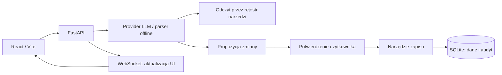

# Pierwotna implementacja MAGAZYNIER — Python / FastAPI

Ten katalog zawiera pierwotną implementację projektu: backend **Python/FastAPI**, bazę **SQLite** i frontend **React/Vite**. Podczas HackYeah 2026 aplikację przeniesiono do Next.js i PostgreSQL. Kod zachowano jako dokumentację wcześniejszej architektury, implementacji oraz testów.

**Bieżąca aplikacja uruchamiana z katalogu głównego nie korzysta z tego backendu.** Jej instrukcja znajduje się w [głównym README](../README.md). Ten przewodnik dokumentuje wersję historyczną; nie deklaruje jej zgodności z obecnym API ani gotowości do wdrożenia produkcyjnego.

## Architektura



Model interpretuje polecenie, a serwer waliduje wywołanie narzędzia. Polecenia zapisu przygotowują kartę do zatwierdzenia. Brak klucza lub błąd providera pozwala skorzystać z parsera offline; pole tekstowe pozostaje alternatywą dla rozpoznawania mowy.

## Przewodnik po kodzie

Ścieżki w tabeli odnoszą się do tego katalogu.

| Plik | Odpowiedzialność | Testy |
|---|---|---|
| [backend/app/main.py](backend/app/main.py) | `create_app()`: endpointy FastAPI, obsługa komend, propozycji, potwierdzeń i WebSocket. | [test_api.py](backend/tests/test_api.py) |
| [backend/app/llm.py](backend/app/llm.py) | `LLMProvider`, `OpenAICompatibleProvider.interpret()`, transport HTTP i walidacja wywołań narzędzi. | [test_llm.py](backend/tests/test_llm.py), [test_llm_completion.py](backend/tests/test_llm_completion.py), [test_llm_registry.py](backend/tests/test_llm_registry.py) |
| [backend/app/parser.py](backend/app/parser.py) | `parse_command()`: deterministyczne rozpoznawanie obsługiwanych intencji. | [test_parser.py](backend/tests/test_parser.py), [test_offline.py](backend/tests/test_offline.py) |
| [backend/app/tools.py](backend/app/tools.py) | Rejestr narzędzi i `call_tool()`: wspólne operacje dla parsera i LLM. | [test_tools.py](backend/tests/test_tools.py) |
| [backend/app/db.py](backend/app/db.py) | SQLite, zmiany zapasu, audyt, undo, szkice zamówień i ich decyzje. | [test_reorder.py](backend/tests/test_reorder.py), [test_reorder_concurrency.py](backend/tests/test_reorder_concurrency.py), [test_api.py](backend/tests/test_api.py) |
| [backend/app/inventory.py](backend/app/inventory.py) | Odczyt CSV/XLSX, mapowanie i walidacja wierszy, eksport stanów. | [test_inventory_import.py](backend/tests/test_inventory_import.py), [test_inventory_export.py](backend/tests/test_inventory_export.py) |
| [backend/app/inventory_mapping.py](backend/app/inventory_mapping.py) | Sugestia przypisania kolumn przez LLM. | [test_inventory_mapping_llm.py](backend/tests/test_inventory_mapping_llm.py) |
| [backend/app/stt.py](backend/app/stt.py) | Integracja transkrypcji audio. | [test_stt.py](backend/tests/test_stt.py) |
| [backend/app/demo.py](backend/app/demo.py) | Osobna baza demo, seed i jawny reset wyłącznie danych demo. | [test_demo.py](backend/tests/test_demo.py) |
| [frontend/src/](frontend/src/) | Interfejs React: komendy, stany, historia, mapa, import i kolejka. | Wybrane testy komponentowej logiki znajdują się obok plików źródłowych. |

## Istotne mechanizmy

### Walidacja i ograniczanie żądań LLM

W `llm.py` metoda `interpret()` przyjmuje schematy narzędzi od wywołującego. `_validate_tool_call()` i `_validate_value()` sprawdzają nazwę narzędzia oraz argumenty. `_decode_json()` odrzuca m.in. zduplikowane klucze; provider odrzuca też odpowiedzi niekompletne, odmowy i wiele wywołań narzędzi naraz.

`_post_json()` ogranicza wielkość odpowiedzi, a `_bounded_post_json()` korzysta ze współdzielonego semafora. `asyncio.wait_for()` ogranicza czas oczekiwania, ale nie zatrzymuje automatycznie wątku wykonującego HTTP. Slot semafora jest dlatego zwalniany dopiero po zakończeniu pracy tego wątku. Te limity nie dowodzą, że poprawna strukturalnie odpowiedź odpowiada intencji użytkownika.

### Współbieżne szkice i decyzje

W `db.py` funkcje `create_reorder_draft()` i `decide_reorder_draft()` obsługują tworzenie oraz rozpatrywanie szkiców. Ograniczenie unikalności oczekującego szkicu i warunkowy zapis chronią przed wyścigiem między odczytem a zmianą. Zdarzenia decyzji trafiają do audytu.

`test_reorder_concurrency.py` wykorzystuje wątki i synchronizację, aby sprawdzić równoczesne operacje. Są to testy implementacji SQLite, nie dowód zachowania dowolnej konfiguracji PostgreSQL.

### Izolacja demo

`demo_db_path()` odrzuca konfigurację wskazującą tę samą ścieżkę co zwykła baza. `init_demo_db()` sprawdza oznaczenie bazy demo przed resetem. Historyczne launchery znajdują się w [scripts/](scripts/); ich ograniczenia po przeniesieniu katalogów opisano poniżej.

## Związek z obecną wersją

Migracja zachowała część logiki i kontraktów, ale zmieniła środowisko wykonania, dostawcę LLM oraz mechanizmy przechowywania danych. Pliki nie są identycznymi implementacjami i były później rozwijane niezależnie.

| Pierwotna implementacja | Obecna implementacja |
|---|---|
| Python `app/llm.py`, provider zgodny z Chat Completions | [src/server/llm.ts](../src/server/llm.ts), provider Gemini; moduł opisany w kodzie jako port wcześniejszego providera |
| Endpointy i komendy w `app/main.py` | [src/app/api/](../src/app/api/) oraz [src/server/commands.ts](../src/server/commands.ts) |
| SQLite w `app/db.py` | [src/server/db.ts](../src/server/db.ts) i [adaptery PostgreSQL/PGlite](../src/server/sql.ts) |
| Parser i rejestr narzędzi | [src/server/parser.ts](../src/server/parser.ts) i [src/server/tools.ts](../src/server/tools.ts) |
| WebSocket do UI | Polling `GET /api/version` |
| Historyczne launchery w `legacy/scripts/` | [scripts/start-demo.py](../scripts/start-demo.py): launcher bieżącej aplikacji Next.js |

Późniejsze funkcje, takie jak kontrola nieaktualnych kart w obecnym backendzie, nie powinny być przypisywane tej wersji Python bez sprawdzenia konkretnej implementacji.

## Uruchomienie i testy

Poniższe polecenia wynikają z zapisanej konfiguracji projektu. **Pełnego uruchomienia legacy i jego zestawu testów nie zweryfikowano ponownie podczas przygotowania tego przewodnika.** Wyniki Vitest z głównego projektu nie obejmują tego backendu.

### Backend

Wymagania: **Python ≥ 3.11** według [pyproject.toml](backend/pyproject.toml) oraz `uv`. Historyczny obraz Dockera używa Pythona 3.12. Pierwsza instalacja zależności wymaga dostępu do sieci.

Z katalogu głównego repozytorium:

```bash
cd legacy/backend
uv sync --frozen
uv run pytest
uv run uvicorn app.main:app --reload --host 127.0.0.1 --port 8000
```

Dokumentacja API: `http://127.0.0.1:8000/docs`. Bez klucza LLM dostępny jest parser offline. Historyczny provider korzysta ze zmiennych `LLM_API_KEY`, `LLM_BASE_URL` i `LLM_MODEL`; nie należy utożsamiać ich z konfiguracją Gemini obecnej aplikacji. Przy ręcznym uruchomieniu ustawiaj potrzebne zmienne w środowisku procesu; nie zakładaj automatycznego odczytu głównego `.env.local`.

Do obejrzenia wybranych mechanizmów można uruchomić sam podzbiór testów z `legacy/backend`:

```bash
uv run pytest tests/test_llm.py tests/test_llm_completion.py tests/test_reorder.py tests/test_reorder_concurrency.py
```

To wybór tematyczny, nie zamiennik całego zestawu. Testy importu i demo korzystają też z plików w głównym `public/`; zachowaj strukturę repozytorium.

### Frontend

W drugim terminalu, z katalogu głównego repozytorium:

```bash
cd legacy/frontend
npm ci
npm run dev
```

Historyczny Dockerfile używa Node.js 22. Konfiguracja Vite przekazuje `/api` i `/ws` do backendu na porcie 8000. Domyślny adres UI to `http://localhost:5173`; sprawdź adres wypisany przez Vite, jeśli port jest zajęty.

### Docker i historyczne skrypty

[docker-compose.yml](docker-compose.yml) opisuje backend i frontend tej wersji. Podstawowe uruchomienie z katalogu głównego repo to:

```bash
docker compose -f legacy/docker-compose.yml up --build
```

To konfiguracja historyczna, nie obecny sposób wdrożenia na Vercel. Nie zweryfikowano jej ponownie przy redagowaniu dokumentacji. Wykorzystuje porty 8000 i 5173 oraz wolumen bazy SQLite.

Znane niespójności ścieżek po przeniesieniu do `legacy/`:

- [docker-compose.demo.yml](docker-compose.demo.yml) montuje `./demo-offline.xlsx`, czyli plik oczekiwany w `legacy/`; rzeczywisty arkusz znajduje się w [public/demo-offline.xlsx](../public/demo-offline.xlsx).
- [scripts/start-demo-local.py](scripts/start-demo-local.py) wypisuje dawną lokalizację arkusza zamiast bieżącego `public/`.

Te wpisy wymagają osobnej poprawki i weryfikacji przed użyciem historycznych launcherów. Do prezentacji aktualnej aplikacji korzystaj z [obecnej instrukcji demo](../docs/demo-offline.md).

## Historia i wybrane zmiany

Poniższe przykłady ułatwiają prześledzenie rozwoju. Nie stanowią pełnego podziału odpowiedzialności ani przypisania całych modułów jednej osobie. Projekt powstawał zespołowo z pomocą narzędzi AI; historia wskazuje autorów dostarczonych zmian.

| Zmiana | Autor w Git | Commit |
|---|---|---|
| Kolejka uzupełniania zapasów | SlizDaniel | [56d02bc](https://github.com/SlizDaniel/AiWARE/commit/56d02bc) |
| Provider LLM w Pythonie | SlizDaniel | [56ba953](https://github.com/SlizDaniel/AiWARE/commit/56ba953) |
| Walidacja odpowiedzi i testy fallbacku | SlizDaniel | [155b773](https://github.com/SlizDaniel/AiWARE/commit/155b773) |
| Limity czasu, rozmiaru odpowiedzi i współbieżności | SlizDaniel | [404edb0](https://github.com/SlizDaniel/AiWARE/commit/404edb0) |
| Jedna decyzja przy równoczesnym rozpatrywaniu szkicu | SlizDaniel | [cbafbe3](https://github.com/SlizDaniel/AiWARE/commit/cbafbe3) |
| Obsługa konfliktu tworzenia oczekującego szkicu | SlizDaniel | [c6bac88](https://github.com/SlizDaniel/AiWARE/commit/c6bac88) |
| Migracja do Next.js, Supabase i Gemini | Michał Szyszło | [b08b793](https://github.com/SlizDaniel/AiWARE/commit/b08b793) |
| Przeniesienie poprzedniej wersji do `legacy/` | Michał Szyszło | [ed8c832](https://github.com/SlizDaniel/AiWARE/commit/ed8c832) |

Pozostały wkład zespołu znajduje się w [historii repozytorium](https://github.com/SlizDaniel/AiWARE/commits/main/). Przy śledzeniu pliku przeniesionego do tego katalogu używaj `git log --follow`, np.:

```bash
git log --follow -- legacy/backend/app/llm.py
```

## Granice tej wersji

- To historyczny prototyp, a nie backend obsługujący aktualnego klienta webowego lub mobilnego.
- Aktualne role Supabase i późniejsze zabezpieczenia nie są automatycznie właściwościami starej implementacji.
- Deterministyczny parser ma ograniczony zakres komend; demo upraszcza paletę do dwóch jednostek.
- Walidacja schematu odpowiedzi LLM nie gwarantuje poprawnego rozpoznania intencji.
- Historyczne skrypty i konfiguracje wymagają weryfikacji po zmianie struktury katalogów.

Kod zachowuje [licencję Apache 2.0 projektu](../LICENSE).
